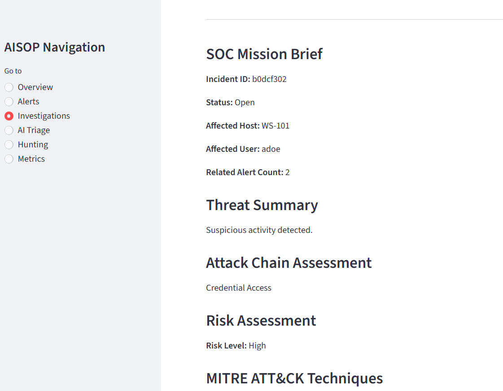
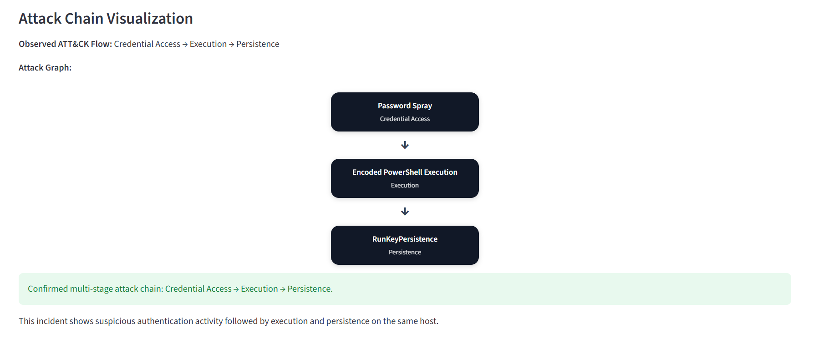
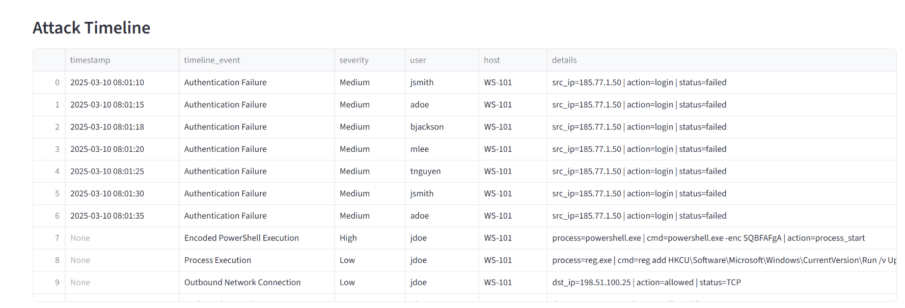
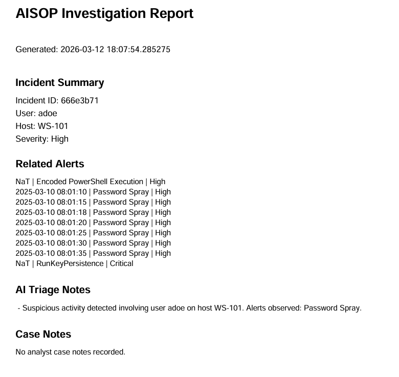

# AISOP – AI Security Operations Platform

AISOP is a Python-based Security Operations Platform built with Streamlit that simulates how modern SOC teams transform raw telemetry into investigations through detection engineering, incident correlation, MITRE ATT&CK mapping, attack chain analysis, and analyst workflows.

The platform demonstrates how security telemetry evolves into actionable incident response through alert generation, incident enrichment, investigation tooling, timeline reconstruction, mission-oriented incident briefing, and exportable investigation reporting.

---

# Platform Overview

AISOP simulates a modern security operations investigation pipeline:

Telemetry  
→ Detection Rules  
→ Alert Generation  
→ Incident Correlation  
→ MITRE ATT&CK Mapping  
→ Attack Chain Reconstruction  
→ Incident Risk Scoring  
→ Analyst Workflow & Investigation  
→ SOC Mission Brief Generation  
→ Investigation Report Export

---

# Platform Architecture

AISOP processes security telemetry through a multi-stage detection and investigation pipeline.

Telemetry Sources  
↓  
Detection Engine  
↓  
Alert Generation  
↓  
Incident Correlation  
↓  
MITRE ATT&CK Mapping  
↓  
Attack Chain Reconstruction  
↓  
SOC Investigation Dashboard  
↓  
SOC Mission Brief  
↓  
Investigation Report Export

---

# Platform Screenshots

## SOC Mission Brief



## Attack Chain Visualization



## Investigation Timeline



## Investigation Report Export



---

# Key Features

- Incident explorer and investigation dashboard
- Alert correlation into incidents
- MITRE ATT&CK tactic and technique mapping
- Multi-stage attack chain reconstruction
- Incident risk scoring and severity context
- Analyst workflow management (status and assignment)
- Event timeline reconstruction
- Raw event inspection
- SOC Mission Brief generation
- Exportable investigation reporting

---

# Investigation Workflow

AISOP demonstrates a realistic SOC investigation lifecycle:

1. Alerts are generated from detection rules
2. Alerts are correlated into incidents
3. Incidents are mapped to MITRE ATT&CK
4. Attack chains are reconstructed from related alerts
5. Analysts investigate incidents using timeline and event data
6. The platform generates a SOC Mission Brief for operational decision support
7. Investigation findings can be exported as a report

---

# Example Investigation Views

## Incident Overview

Displays incident severity, risk score, affected host/user, and correlated alerts.

## SOC Mission Brief

Summarizes incident context, attack chain assessment, risk level, recommended actions, and analyst notes in a mission-oriented format.

## Attack Chain Visualization

Reconstructs ATT&CK progression such as:

Initial Access → Execution → Persistence

## Investigation Timeline

Shows ordered security events tied to the incident.

## Investigation Report

Analysts can export a SOC-style investigation report summarizing:

- Incident details
- Related alerts
- MITRE ATT&CK context
- Triage summary
- Recommended actions

---

# Technology Stack

- Python
- Streamlit
- Pandas
- ReportLab

---

# Purpose

AISOP is a portfolio project designed to demonstrate applied skills in:

- Detection Engineering
- SOC Operations
- Incident Response
- Security Analytics
- Python Security Tooling
- Investigation Workflow Design

---
# Running the Project

Clone the repository:

```bash
git clone https://github.com/santinoholmes1979/aisop.git
cd aisop

Install dependencies:

pip install -r requirements.txt

Run the application:

streamlit run app.py

Future Improvements

AI-assisted triage summaries

Threat intelligence enrichment

Automated detection rule evaluation

Expanded incident reporting options

About

AI Security Operations Platform with incident correlation, MITRE ATT&CK mapping, attack chain reconstruction, mission-oriented incident briefing, and SOC investigation workflow.