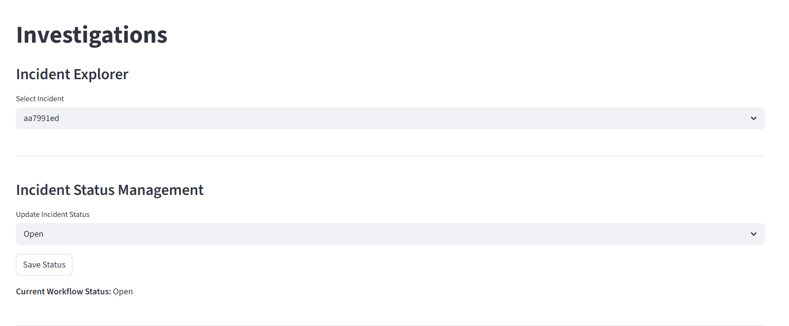

# AISOP – AI Security Operations Platform

AISOP is a Python-based Security Operations Platform built with **Streamlit** that simulates how modern SOC teams transform raw telemetry into investigations through detection engineering, incident correlation, MITRE ATT&CK mapping, attack chain analysis, and analyst workflows.

The platform demonstrates how security telemetry evolves into actionable incident response through alert generation, incident enrichment, investigation tooling, timeline reconstruction, and exportable investigation reporting.

---

## System Architecture & SOC Investigation Workflow

AISOP simulates how a modern Security Operations Center converts raw telemetry into structured investigations.
The platform models the full pipeline from security event generation to analyst investigation and reporting.

### Architecture Overview

Security Telemetry Generator
        │
        ▼
   Raw Endpoint Events
        │
        ▼
   Detection Engine
   (MITRE ATT&CK aligned rules)
        │
        ▼
   Alert Generation
        │
        ▼
   Incident Correlation Engine
        │
        ▼
   ATT&CK Mapping & Enrichment
        │
        ▼
   Attack Chain Reconstruction
        │
        ▼
   Investigation Timeline
        │
        ▼
   SOC Analyst Dashboard (Streamlit)
        │
        ▼
   Investigation Report Export

### Platform Components

#### Security Telemetry Generator
Simulates enterprise endpoint telemetry including process activity, authentication events, and persistence mechanisms to model adversary behavior within a controlled environment.

#### Detection Engine
Applies detection logic aligned with **MITRE ATT&CK techniques** to identify suspicious behavior such as:

- Encoded PowerShell execution
- Password spraying activity
- Registry persistence

#### Alert Generation
Security events that match detection rules are converted into structured alerts for analyst triage.

#### Incident Correlation Engine
Alerts are automatically grouped into incidents based on shared indicators such as:

- Host
- User
- Time window
- Behavioral pattern

This models how SOC platforms correlate alerts into investigations.

#### ATT&CK Mapping & Enrichment
Detected behaviors are mapped to **MITRE ATT&CK tactics and techniques** to provide contextual understanding of adversary activity.

#### Attack Chain Reconstruction
AISOP reconstructs adversary behavior sequences by linking related events into a coherent attack chain, helping analysts understand how an intrusion unfolded.

#### Investigation Timeline
Incidents are visualized through structured timelines allowing analysts to follow the progression of attacker activity across systems.

#### SOC Analyst Dashboard
A **Streamlit-based investigation interface** enables analysts to:

- Review incidents
- Pivot across telemetry
- Analyze attack chains
- Evaluate alert context

#### Investigation Report Export
AISOP generates structured investigation reports summarizing:

- Incident context
- Attack chain analysis
- MITRE ATT&CK mapping
- Analyst findings

These reports simulate the type of documentation produced during real security investigations.

## Why AISOP Was Built

AISOP was designed to explore how security telemetry, detection engineering, and analyst workflows connect inside modern SOC environments.

The project demonstrates how security analytics platforms convert raw telemetry into actionable investigations, supporting rapid understanding of adversary behavior in mission-critical environments.

## Design Philosophy

AISOP was designed to reflect how real Security Operations Centers process and analyze security telemetry.  
The platform emphasizes several core principles common to modern security analytics systems.

**Telemetry-Driven Analysis**

Security detections are built around behavioral signals within telemetry rather than static indicators, reflecting how modern SOC teams identify adversary activity.

**Detection Engineering Workflow**

AISOP models how raw security events move through a detection pipeline where rules generate alerts, alerts correlate into incidents, and incidents become structured investigations.

**Contextual Investigation**

The platform enriches alerts with MITRE ATT&CK mapping, timeline reconstruction, and attack chain visualization so analysts can understand adversary behavior rather than isolated alerts.

**Human-in-the-Loop Security**

AISOP emphasizes analyst decision-making by providing investigation dashboards, timeline views, and exportable reports rather than fully automated response.

**Explainable Security Analytics**

The system prioritizes transparent detection logic and investigation workflows so analysts can understand why alerts occur and how incidents evolve.

## Technologies Used

Python

Streamlit

MITRE ATT&CK Framework

Security Telemetry Simulation

Detection Engineering Pipelines

Incident Correlation Logic

---

# Platform Screenshots

## Incident Investigation Dashboard

## Attack Chain Visualization

## Investigation Timeline

## Investigation Report Export

# Key Features

• Incident explorer and investigation dashboard  
• Alert correlation into incidents  
• MITRE ATT&CK tactic and technique mapping  
• Multi-stage attack chain reconstruction  
• Incident risk scoring and severity context  
• Analyst workflow management (status + assignment)  
• Attack graph visualization  
• Event timeline reconstruction  
• Raw event inspection  
• Exportable **Investigation Report (PDF)**

---

# Investigation Workflow

AISOP demonstrates a realistic SOC investigation lifecycle:

1. Alerts are generated from detection rules
2. Alerts are correlated into incidents
3. Incidents are mapped to MITRE ATT&CK
4. Attack chains are reconstructed from related alerts
5. Analysts investigate incidents using timeline and event data
6. Investigation findings can be exported as a report

---

# Example Investigation Views

## Incident Overview
Displays incident severity, risk score, affected host/user, and correlated alerts.

## Attack Chain Visualization
Reconstructs ATT&CK progression such as:

Initial Access → Execution → Persistence

## Investigation Timeline
Shows ordered security events tied to the incident.

## Investigation Report
Analysts can export a SOC-style investigation report summarizing:

• Incident details  
• Related alerts  
• MITRE ATT&CK context  
• Triage summary  

---

# Technology Stack

Python  
Streamlit  
Pandas  
ReportLab (PDF generation)

---

# Running the Project

# Clone the repository
git clone https://github.com/santinoholmes1979/aisop.git

# Navigate to project directory
cd aisop

# Install dependencies
pip install -r requirements.txt

# Run the platform
streamlit run app.py

---

## What This Project Demonstrates

• SOC platform architecture  
• Detection engineering pipelines  
• Security telemetry analysis  
• MITRE ATT&CK investigation workflows  
• Attack chain reconstruction  
• Analyst investigation tooling

---

# Future Improvements

AI-assisted triage summaries  
Interactive incident timeline visualization  
Threat intelligence enrichment  
Automated detection rule evaluation
